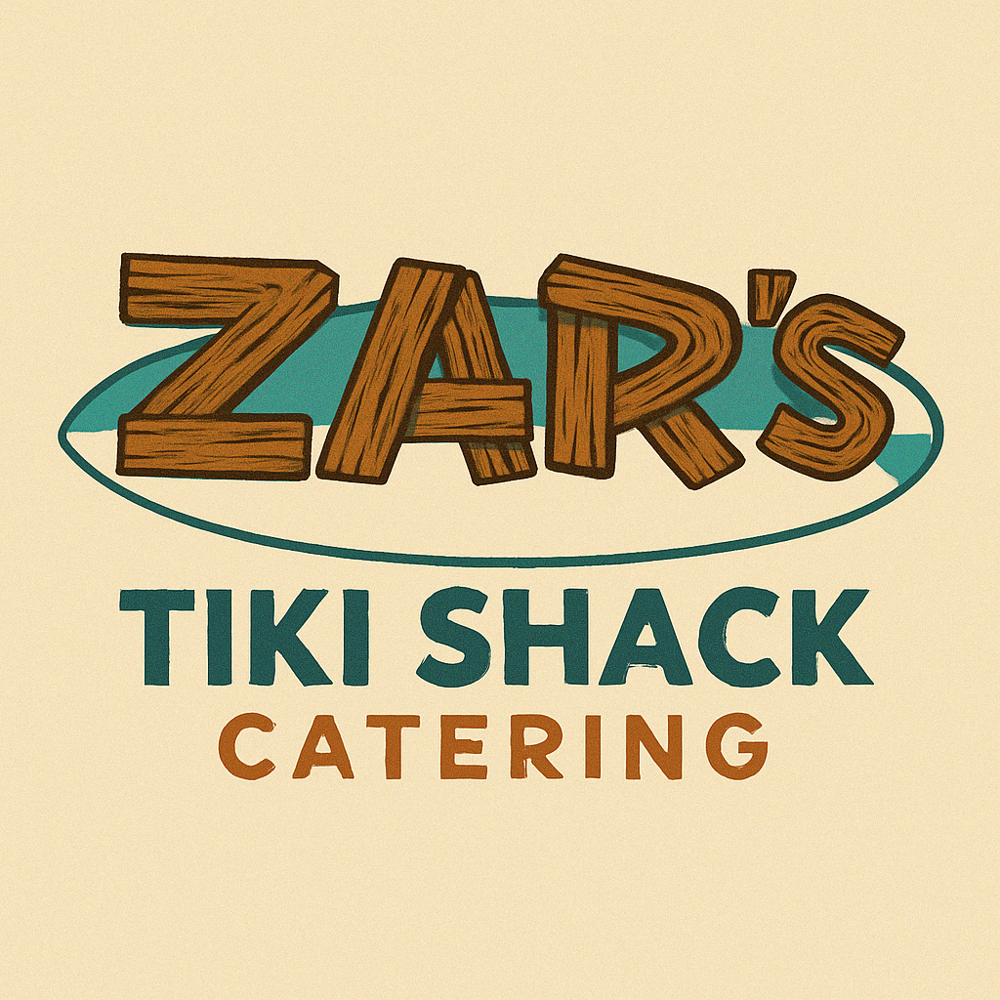

# Zar's Tiki Shack - Hawaiian Shave Ice Catering

[](https://opensource.org/licenses/MIT)
[](https://reactjs.org/)
[](https://vitejs.dev/)
[](https://www.typescriptlang.org/)

A modern and responsive website for Zar's Tiki Shack, a Hawaiian shave ice catering service. Experience the taste of authentic Hawaiian shave ice at your next event!



## 🌟 Features

- 📱 Responsive design for mobile, tablet, and desktop
- 🎨 Modern UI with Tailwind CSS and shadcn/ui components
- 🔒 Type-safe development with TypeScript
- ⚡ Fast development with Vite
- 📧 Integrated contact form with EmailJS
- 🎯 SEO optimized
- 🚀 Easy deployment

## 🛠️ Technologies Used

- **Frontend Framework**: React 18.3
- **Build Tool**: Vite 5.4
- **Language**: TypeScript 5.5
- **Styling**: Tailwind CSS 3.4
- **UI Components**: shadcn/ui
- **Routing**: React Router 6.26
- **Form Handling**: React Hook Form
- **Email Integration**: EmailJS

## 🚀 Quick Start

### Prerequisites

- Node.js (v16 or higher)
- npm or yarn

### Installation

```bash
# Clone the repository
git clone https://github.com/your-username/tiki-catering-clone.git

# Navigate to the project directory
cd tiki-catering-clone

# Install dependencies
npm install
```

### Development

```bash
# Start the development server
npm run dev
```

The development server will start at http://localhost:8080 (or another port if 8080 is in use).

### Production Build

```bash
# Build for production
npm run build

# Preview the production build
npm run preview
```

## 📁 Project Structure

```
src/
├── components/     # Reusable components
│   └── ui/        # UI components from shadcn/ui
├── pages/         # Page components
├── lib/           # Utility functions and helpers
├── hooks/         # Custom React hooks
└── assets/        # Static assets
```

## 📧 Contact Form Setup

The contact form is powered by EmailJS for serverless email functionality. [View setup instructions](#contact-form-setup)

## 🌐 Deployment Options

1. **Via Lovable**
   - Visit [Lovable Project](https://lovable.dev/projects/517cc1a7-4328-4a35-9253-e38abbed93f3)
   - Click Share -> Publish

2. **Custom Domain**
   - Navigate to Project > Settings > Domains
   - Click Connect Domain
   - [Detailed guide](https://docs.lovable.dev/tips-tricks/custom-domain#step-by-step-guide)

## 💻 Development Options

1. **Use Lovable**
   - Visit the [Lovable Project](https://lovable.dev/projects/517cc1a7-4328-4a35-9253-e38abbed93f3)
   - Start prompting for changes

2. **Local Development**
   - Clone the repository
   - Install dependencies
   - Use your preferred IDE

3. **GitHub Codespaces**
   - Launch directly from GitHub
   - Full development environment in the browser

## 📝 Contact Form Setup

The contact form on this website is powered by EmailJS, which allows the form to send emails directly from the browser without needing a backend server.

### Setting up EmailJS for the Contact Form

1. **Create an EmailJS Account**
   - Go to [EmailJS website](https://www.emailjs.com/) and sign up for a free account
   - The free tier allows 200 emails per month

2. **Add an Email Service**
   - From your EmailJS dashboard, go to "Email Services"
   - Click "Add New Service"
   - Choose your email provider (Gmail, Outlook, etc.)
   - Follow the authorization steps to connect your email

3. **Create an Email Template**
   - Go to "Email Templates" in your dashboard
   - Click "Create New Template"
   - Use the following dynamic variables in your template:
     - `{{name}}` - The sender's name
     - `{{email}}` - The sender's email
     - `{{phone}}` - The sender's phone number
     - `{{event_date}}` - The event date
     - `{{event_type}}` - The type of event
     - `{{guest_count}}` - The number of guests
     - `{{location}}` - The event location
     - `{{message}}` - The message content

4. **Update the Contact Component**
   - Open `src/components/Contact.tsx`
   - Update the following constants with your EmailJS credentials:
     ```javascript
     const EMAILJS_SERVICE_ID = "service_xxxx";  // Update with your Service ID
     const EMAILJS_TEMPLATE_ID = "template_xxxx"; // Update with your Template ID
     const EMAILJS_PUBLIC_KEY = "xxxx";          // Update with your Public Key
     ```

5. **Test the Form**
   - Fill out the contact form on your website
   - Submit the form and verify that you receive the email
   - Check for any errors in the browser console

### Notes
- The EmailJS Public Key is safe to include in client-side code
- For increased security, consider adding Google reCAPTCHA to your form
- The form includes basic validation for required fields

## 🤝 Contributing

Contributions are welcome! Please feel free to submit a Pull Request.

1. Fork the repository
2. Create your feature branch (`git checkout -b feature/AmazingFeature`)
3. Commit your changes (`git commit -m 'Add some AmazingFeature'`)
4. Push to the branch (`git push origin feature/AmazingFeature`)
5. Open a Pull Request

## 📄 License

This project is licensed under the MIT License - see the [LICENSE](LICENSE) file for details.

## 📞 Contact

For questions or support, please reach out through:
- The contact form on the website
- Opening an issue in this repository

## 🙏 Acknowledgments

- [shadcn/ui](https://ui.shadcn.com/) for the beautiful UI components
- [Tailwind CSS](https://tailwindcss.com/) for the utility-first CSS framework
- [Vite](https://vitejs.dev/) for the blazing fast build tool
- [EmailJS](https://www.emailjs.com/) for the contact form functionality
